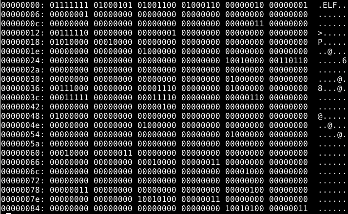

#Raportti H0

Loin virtuaalikoneen Oracle VirtualBox johon asensin Debian linuxin ja tarvittavat työkalut (gcc, xdd)
Virtuaalikoneessa käytin "nano" -komentoa ja loin h0.c nimisen tiedoston.
Tähän tiedostoon kirjoitin C-kielisen hello worldin.
Sitten "gcc" -komennolla loin "h0.c" -tiedoston pohjalta "a.out" -tiedoston (oletus nimi tiedostolle jota ei muuten nimetä).
Tämänjälkeen tulostin tiedoston sisällön "xxd -b a.out | less" -komennolla tarkasteltavaksi.

 (kuva)

Tiedosto sisältää binääri koodin ja tarkastelemisesta ja googlaamalla sain selville että ELF merkintä oikealla on lyhenne sanoista Executable and Linkable Format, joka on standardi binääri muoto linux pohjaisille ohjelmille.