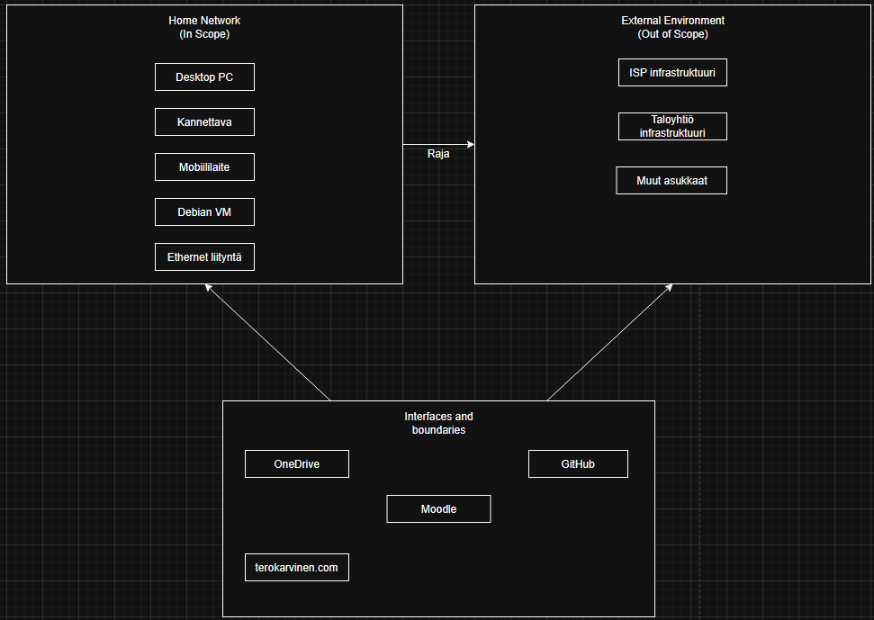
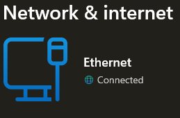
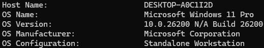
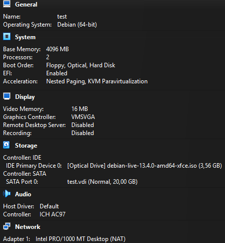

# H1
## a) Scope

### Infrastruktuuri
- Taloyhtiön Ethernet

### Laitteet
- Windows Desktop PC
- Windows kannettavatietokone
- Android-mobiililaite
- Debian-virtuaalikone (Oracle VirtualBox)

### Tieto ja data
- Kurssimateriaalit
- Kurssitehtävät
- Moodle
- Näytönkaappaukset
- Muistiinpanot
- Käyttäjätunnukset ja salasanat

### Järjestelmät ja palvelut
- Moodle
- GitHub
- OneDrive
- terokarvinen.com -sivusto

### Käyttöliittymät ja rajapinnat
- Mobiililaitteen authenticator
- Ethernet-yhteys
- Internet-yhteys

---

## Scope ei sisällä

| Kohde | Syy |
|---|---|
| Ethernet-verkon taustalla oleva infrastruktuuri | Ei ole hallinnassani |
| ISP:n verkkoinfrastruktuuri | Ei ole hallinnassani |
| Taloyhtiön muut asukkaat ja heidän laitteensa | Ei ole hallinnassani |
| Laitteet jotka eivät liity kurssiin (konsolit, älylaitteet yms.) | Ei liity kurssiin |

## Diagrammi          

## What evidence could I present

**Taloyhtiön Ethernet**

**Windows Desktop PC**

**Windows kannettavatietokone**
- Lenovo ThinkPad T14 Gen 1
- Windows 11 Pro

**Android-mobiililaite**
- OnePlus 13
- OxygenOS 16.0.5

**Debian-virtuaalikone (Oracle VirtualBox)**

## b)
| Interested Party | Need or Requirement | ISO 27001 Reference (Requirement Area) | How Compliance Is Demonstrated (Evidence) |
|---|---|---|---|
| **Minä** | Kurssin suorituksen jatkuvuus ja oman datan säilyminen| Suunnittelu (6) / Toiminta (8) | github repositorio, joka osoittaa kurssitöiden säännöllisen tallentamisen |
| **ISP** | Palvelusopimuksen ja käyttöehtojen noudattaminen. Liittymää ei käytetä väärin esim. luvattomien julkisten palvelinten pystyttäminen | Toiminta (8) | Ote ISP:n käyttöehdoista tai viittaus niihin; reitittimen konfiguraatio, joka osoittaa ettei porttiohjauksia/julkisia palveluita ole avattu sopimuksen vastaisesti |

#### Tämän tiedoston muotoiluun on käytetty Claude Sonnet 5