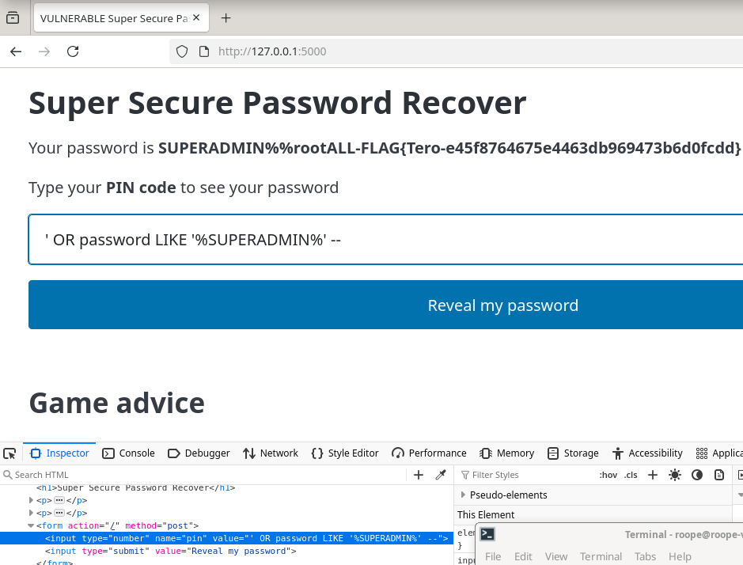
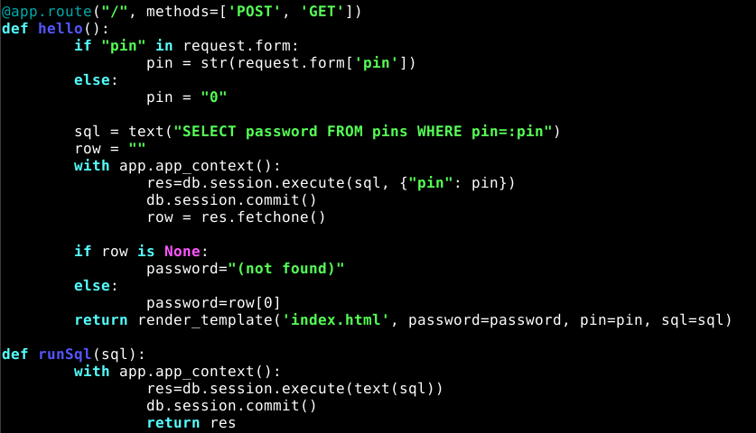
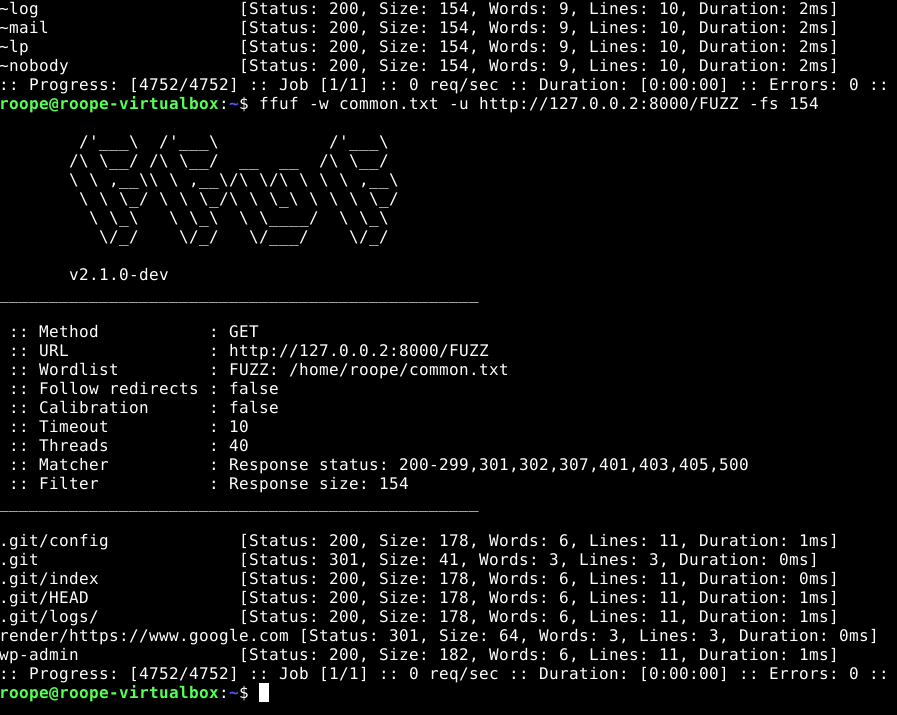
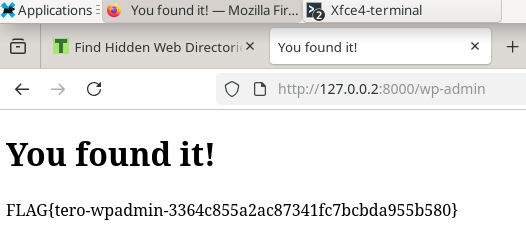
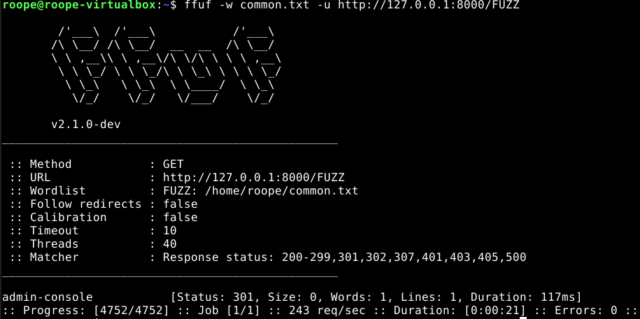
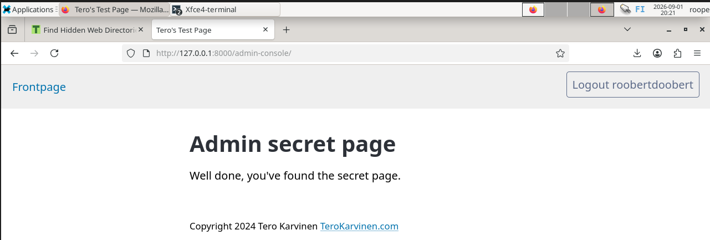
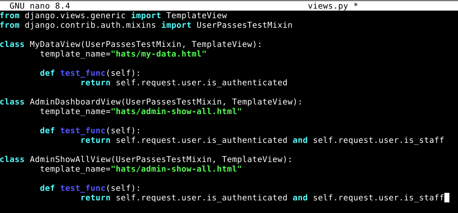

# h2
## x) Muistiinpanoja materiaaleista:
### Broken access control
Access control tarkoittaa, ettei käyttäjä voi toimia sallittujen oikeuksien ulkopuolella.
Epäonnistumiset johtavat tiedon luvattomaan paljastumiseen tai tiedon muuttamiseen tai tuhoutumiseen.
Haavoittuvuuksia ovat muun muassa:
* Oletus arvoisen estämisen periaatteen rikkominen
* Käyttöoikeuksien hallinnan ohittaminen muokkaamalla url:ia, html sivua tai API -pyyntöjä
* Toisen tilin muokkaaminen sen yksilöllisellä tunnisteella
* API:n käyttö puutteellisella käyttöoikeuksien hallinnalla
* Oikeuksien korottaminen, toimiminen käyttäjänä ilman sisääkirjautumista ja toimiminen järjestelmänvalvojana, kun on kirjautunut käyttäjänä.
* Metatietojen manipulointi esim. JWT hallintatunnuksen toisto tai peukalointi, evästeen tai piilotetun kentän manipulointi oikeuksien korottamiseksi.
* CORS:in virheellinen määritys, joka sallii API -käytön luvattomista lähteistä.
* Todennuksen vaativien sivujen selaaminen todentamattomana käyttäjänä tai oikeuden vaativien sivujen selaaminen perus käyttäjänä.
### Fuzz URLs with ffuf
* Fuzzer is a tool used to find hidden directories / endpoints.
* Fuff can be used to fuzz headers, POST params etc.
### Portswigger
* Authentication: varmistaa että käyttäjä on kuka sanoo olevansa
* Session management: seuraa että seuraavat http pyynnöt ovat saman käyttäjän tekemiä
* Access control: määrittää onko käyttäjällä oikeus suorittaa toiminto, jota käyttäjä yrittää suorittaa
* Vertical control: estää tietyn tyyppisen käyttäjän pääsyn toimintoihin, jotka eivät sille kuulu.
* Horizontal control: estää käyttäjän pääsyn resursseihin, jotka eivät sille kuulu.
* Context-dependent access control: rajoittaa pääsyä resursseihin ja toimintoihin riippuen tilasta missä sovellus on
#### Tapoja estää haavoittuvuuksia: 
* Älä luota vain resurssien tai toimintojen piilottamiseen
* Estä pääsy ei julkisiin toimintoihin ja resursseihin oletuksena
* Jos mahdollista sovella yhtä sovelluksen kattavaa toimintoa, jolla hallitaan pääsyä
* auditoi ja testaa pääsyn hallintaa varmistaaksesi että se toimii niinkuin pitää
### SQL Injection
* hyökkäys, missä hyökkääjä muokkaa pyyntöä, jonka sovellus tekee tietokantaan.
* voidaan käyttää saamaan tietoja tietokannasta, joita sieltä ei kuulu saada
* voidaan käyttää ohittamaan kirjautumis pyynnön salasana osuus

## Tehtävät h2
### environment
nämä tehtävät on suoritettu käyttäen:
* Oracle VirtualBox
* Debian 13.6
* Firefox

### a)
  
Vaiheet:
* Muokkasin html tiedostoa siten että formin input type="string" (Ei näy kuvassa)
* Sen jälkeen lähdin kokeilemaan sql injection tekemistä syötteellä ' OR
* Useiden yritysten jälkeen ratkaisin tehtävän ' OR password LIKE '%SUPERADMIN%' , joka siis etsii salasanojen joukosta sellaisen joka sisältää SUPERADMIN
### b)
  
* Muokkasin staff-only.py tiedostoa siten, että käyttäjäsyötettä ei liitetä suoraan sql lauseeseen, vaan se annetaan execute() funktiolle parametrina.
* Tämä on turvallista, sillä tietokanta saa sql lauseen ja pin parametrin erillään ja sitten se asettaa parametrin sql lauseeseen.
### c)
  
* fuzzasin common.txt listan avulla dirfuzt-1. Listan mukaan suurin osa vastauksista oli size: 154
* sitten filtteröin -fs kaikki kokoa 154 olevat pois listasta ja kokeilin jäljelle jäävistä wp-admin endpointtia.

### d)
  
* fuzzasin käyttäen common.txt listaa endpointteja ja löysin yhden "admin-console"  
  
* sivulle pääsi sisään rekisteröitymällä ja vaihtamalla url osoitteeseen endpointiksi /admin-console/
### e)

* Haavoittuvuuden syy oli views.py tiedostossa viimeisestä testi functiosta oli jätetty pois "and self.request.user.is_stuff", joten korjaus oli lisätä se tiedostoon. 
## Lähteet:
Karvinen, Tero: Kurssimateriaali, Sovellusten hakkerointi ja haavoittuvuudet -kurssi https://terokarvinen.com/application-hacking/#homework-tasks  
OWASP Top 10:2021: https://owasp.org/Top10/2021/A01_2021-Broken_Access_Control/index.html  
Karvinen, Tero: Kurssimateriaali (2023), Sovellusten hakkerointi ja haavoittuvuudet -kurssi https://terokarvinen.com/2023/fuzz-urls-find-hidden-directories/  
PortSwigger: Access control vulnerabilities and privilege escalation https://portswigger.net/web-security/access-control   
Karvinen, Tero: Kurssimateriaali, Sovellusten hakkerointi ja haavoittuvuudet -kurssi https://terokarvinen.com/2006/raportin-kirjoittaminen-4/  
PortSwigger: SQL Injection https://portswigger.net/web-security/sql-injection#how-to-prevent-sql-injection  
SQLAlchemy 2.0 Documentation https://docs.sqlalchemy.org/en/20/core/sqlelement.html#sqlalchemy.sql.expression.text  
PortSwigger (2022) What is SQL injection? - Web Security Academy https://www.youtube.com/watch?v=wX6tszfgYp4