# H3
### a)
Latasin ezbin-challenges.zipin ja purin sen unzip komennolla.
Sitten ajoin ohjelman ja kokeilin sitä.
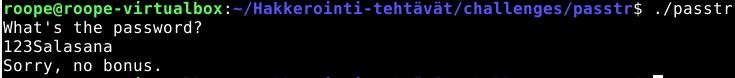    
Sitten tutkin hieman strings komentoa joka mainittiin tehtävän annossa ja käytin sitä passtr tiedostoon. Komennon tulosteesta bongasin salasanan "sala-hakkeri-321", jonka pitäisi tulostaa oikea vastaus ja FLAG.
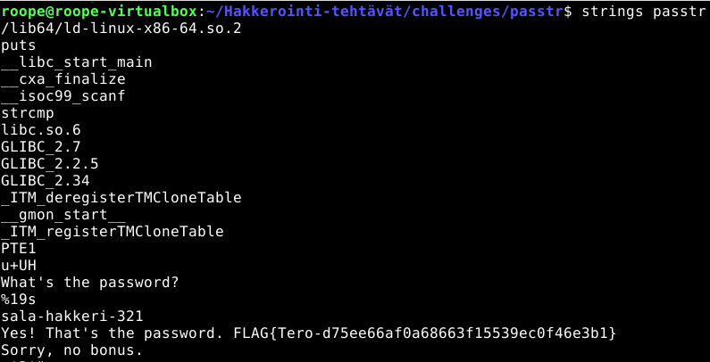    
Sitten vielä testasin että se  varmasti toimi.
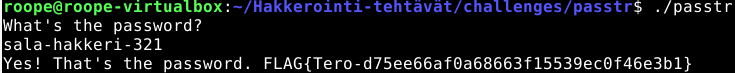  

### b)
Koodin muokkaamisessa käytetty Claude Sonnet 5

Ongelman korjaamisen aloitin tutkimalla lähdekoodia. Lähde koodista selvisi, että salasana on kirjoitettu sinne sellaisenaan, joten ajattelin että sen saisi korjattua hashaamalla.
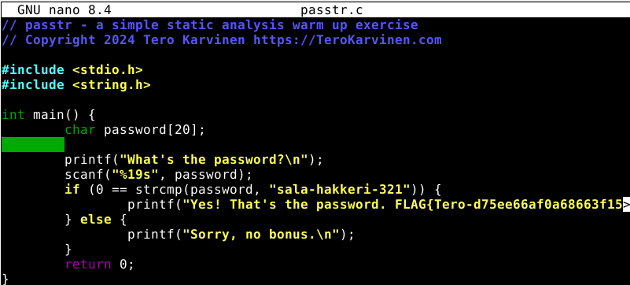  

Muutin koodia, siten että salasana on hashattu SHA-256 tiiviste funktiolla ja salasanan syöttäminen ohjelmaan vertaa syötettä, joka menee saman funktion läpi tuohon olemassa olevaan 32 tavuiseen hexadecimaali taulukkoon, joka luotiin alkuperäisen "sala-hakkeri-321" pohjalta. 
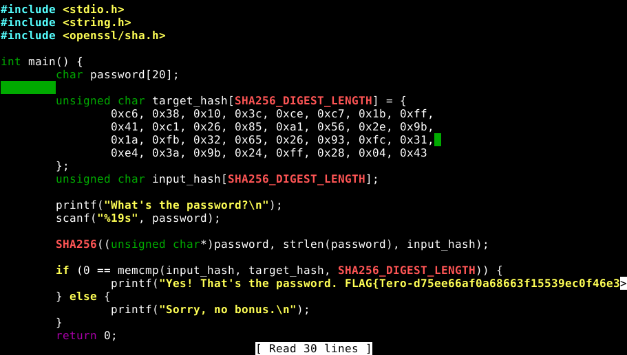  

Valmis heksadecimaali taulukko, jonka sijoitin koodiin, puolestaan syntyi seuraavalla komennolla.
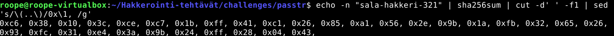  

Testaamalla strings komentoa uudestaan voidaan todeta myös salasanan kadonneen tulosteesta.
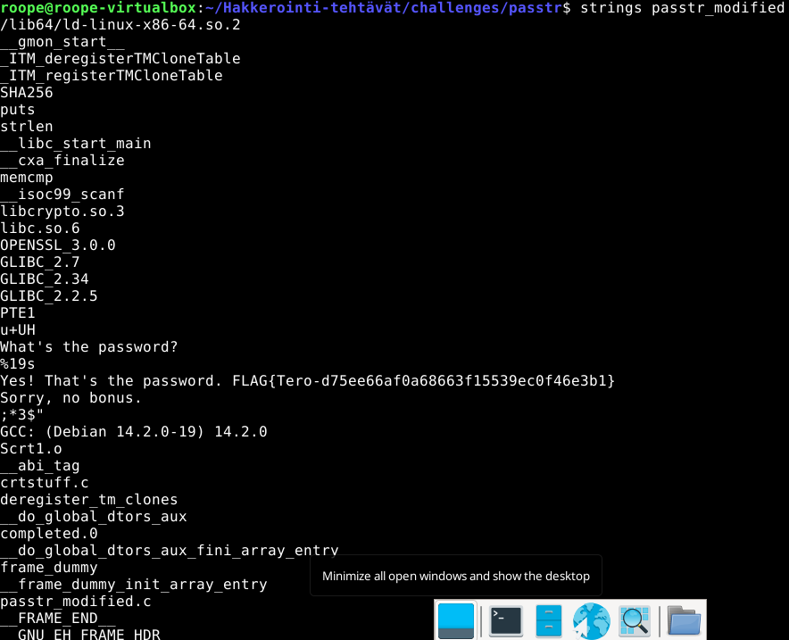  

### c)
Aloitin C tehtävän tutkimisen "strings packd" komennolla ja tutkin tulostetta.
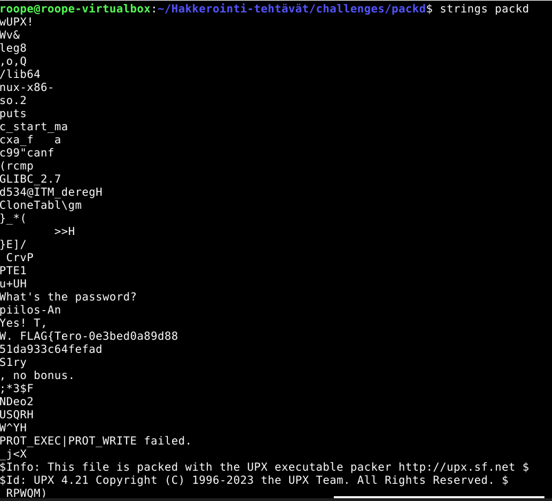  
Tulosteessa kiinnitin huomiota "This file has been packed with UPX executabel packer" kohtaan.

Latasin UPX:
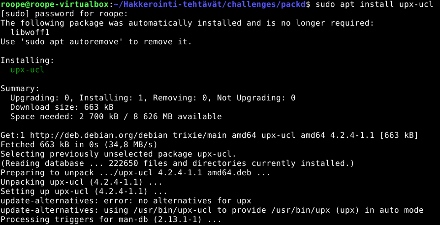  

Jonka jälkeen suoritin komennon:
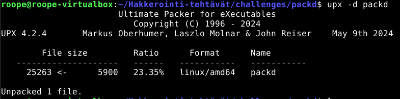  

Tiedoston purettuani kokeilin strings kometoa uudelleen ja nyt tuloste oli luettavassa muodossa.
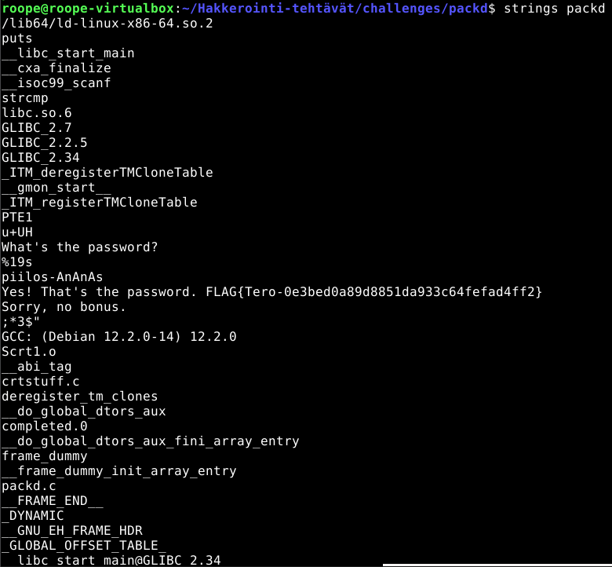  

Nyt tiedostosta pystyi bongaamaan salasanan piilos-AnAnAs, joka on tehtävän ratkaisu. 

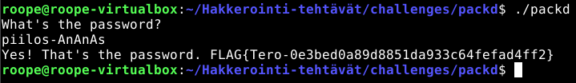

### Lähteet: 
SHA-256 https://emn178.github.io/online-tools/sha256.html
UPX: the Ultimate Packer for eXecutables: https://upx.github.io/
