# h4
### Summary
* strace valvoo ohjelman ja ytimen välisiä järjestelmä kutsuja
* ltrace valvoo kutsuja ohjelman ja jaettujen kirjastojen välillä
* ghidra on käänteismallinnustyökalu, jolla voidaan kääntää binääri C -kielelle ja siten tutkia miten sovellus toimii, ilman lähdekoodia
ghiddra vaatii JDK

## a)
Komennot joilla latasin ghidran ja suoritin sen. Valitettavasti komennot katosivat terminaalista paketin purkamisen yhteydessä, joten näytönkaappaukset puuttuvat.  
Komennot järjestyksessä:
* sudo apt install openjdk-21-jdk -y
* wget https://github.com/NationalSecurityAgency/ghidra/releases/download/Ghidra_11.3.2_build/ghidra_11.3.2_PUBLIC_20250415.zip
* unzip ghidra_11.3.2_PUBLIC_20250415.zip -d ~/tools
* cd ~/tools/ghidra_11.3.2_PUBLIC
* ./ghidraRun

## note
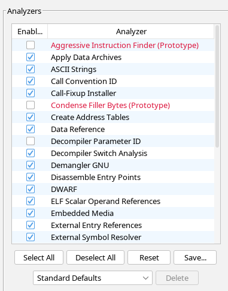  
Tehtävissä on jätetty ghidran standardi asetukset päälle, ellei erikseen mainita.

## b)
Tässä tehtävässä annoin ghidralle aikaisemmin kurssilla esiintyneen packd tiedoston binäärin ja käänteismallinsin sen huonoksi C kieleksi.
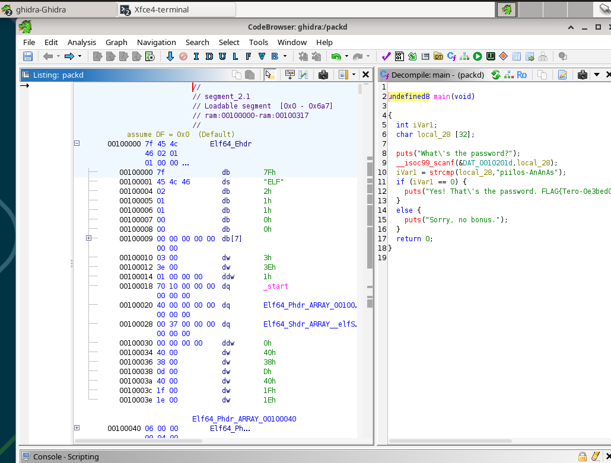  

Ghidran käännöksen mukaan voi todeta että:
* se pyytää käyttäjältä salasanaa (tuloste rivi 8 ja syöte rivi 9)
* se tekee strcmp vertauksen syötetylle ja valmiille arvolle rivillä 10
* jos palaute on 0 se tarkoittaa että merkkijonot ovat identtiset ja ohjelma tulostaa "Yes! That's the password ja FLAG:in
* Positiivinen tai negatiivinen luku johtavat else osioon joka tulostaa "Sorry, no bonus"

## c)
Aloitin tehtävän tuomalla ghidraan passtr tiedoston ja analysoin sen ghidralla. Klikkaamallaa jotakin riviä decompilerissa se vei suoraan listing näkymään vastaavaan kohtaan, joten kun painoin riviä 11 se vei suoraan tähän kohtaan
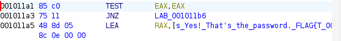
Googlasin TEST, JNZ ja LEA ja sain selville Stack Overflowta lukemalla että JNZ (Jump if not zero) on ohje testille, miten kuuluu toimia, joten jos se muutetaan päinvastaiseksi JZ (jump if zero) sen pitäisi kääntää ohjelma siten, että sisäänkirjautuminen onnistuu kaikilla paitsi oikealla salasanalla.

Koodia pystyi muokkaamaan "Patch Instruction" toiminnolla, joka löytyi hiiren oikean näppäimen painalluksen avaamasta valikosta.
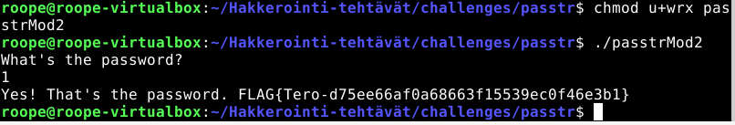

## d)
Latasin kaikki NoraCodes crackme tiedostot githubista.
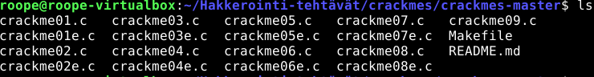
Muutin tarvittavat tiedostot binääriksi cc komennolla.
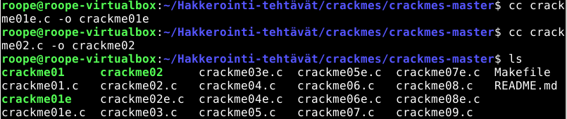

## e) crackme01
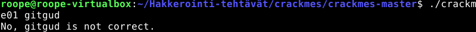  
 Ohjelma haluaa jonkin parametrin. Ajoin ensimmäisenä strings komennon ja kiinnitin tulosteessa huomiota tähän kohtaan: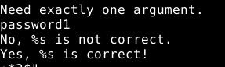  

Testasin antaa parametrina password1 ja se toimi.
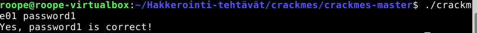

## e) crackme01e
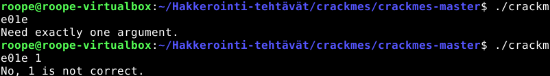  
Tässäkin tehtävässä ohjelma halusi jonkin parametrin, joten kokeilin strings komentoa uudelleen.

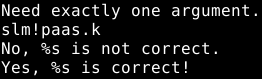  
Strings tulosteesta löytyi vastaava kohta edelliseen tehtävään. 

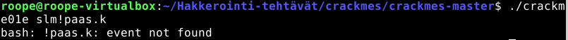  
Kysyin claudelta (Sonnet 5 medium) mitä "!paas.k: event not found" tarkoittaa ja selvisi että "!" on bashissa merkki joka on varattu kutsuille komento historiasta ja ratkaisu tähän on laittaa se heittomerkkien sisälle.

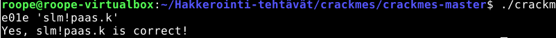  

## f)
Aloitin tehtävän importoimalla crackme02 ghidraan ja analysoimalla sen. Listauksessa käytin "go to" toimintoa etsiäkseni main lohkon, valitsin sen ja avasin decompilerin.

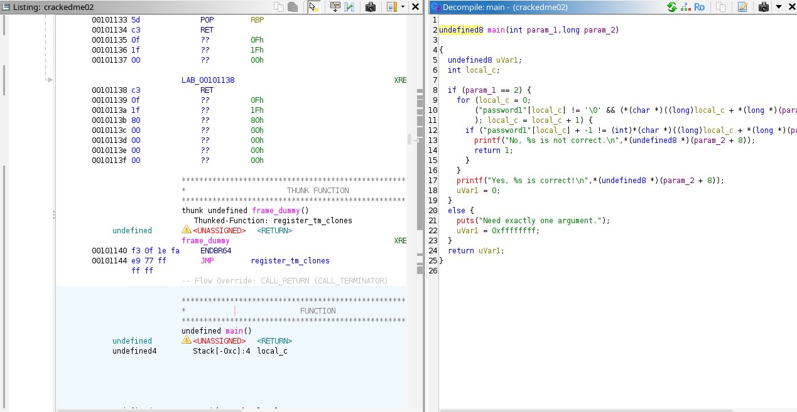  

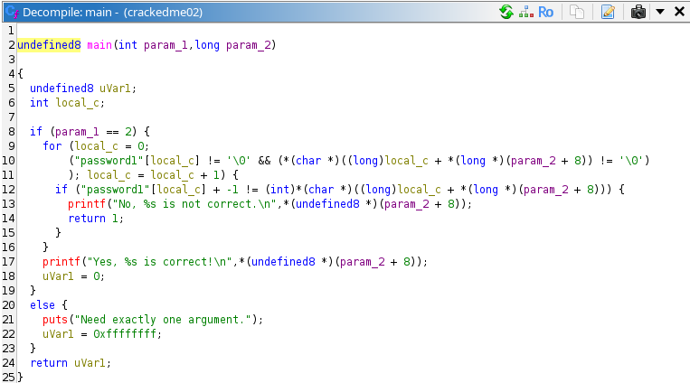  

Decompilerista nähdään mitä riveillä tapahtuu  
rivi 2: määritellään main funktio ja sen parametrit
 rivi 5: julistetaan muuttuja uVarl
 rivi 6: julistetaan muuttuja local_c jonka tietotyyppi on int
 rivi 8: tarkistaa onko param_1 yhtäsuuri kuin 2
 rivi 9: alustaa for silmukan ja asettaa local_c == 0
 rivi 10: vertaa password1 ja 

## Lähteet:
Stackoverflow JNZ: https://stackoverflow.com/questions/14841169/jnz-cmp-assembly-instructions  
Stackoverflow LEA: https://stackoverflow.com/questions/1658294/whats-the-purpose-of-the-lea-instruction  