# h5
Tämän dokumentin muotoiluun on käytetty Claude Sonnet 5.0 Medium

Latasin tehtävät moodlesta, loin niille uuden hakemiston ja purin zip tiedoston sinne.

## lab0

Käänsin buggy_program.c tiedoston binääriksi g++ komennolla. Sitten ajoin gdb ja latasin siihen kyseisen binäärin.

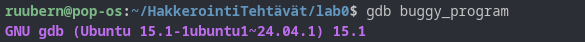

Sitten suoritin gdb:n list komennon jonka tuloste oli seuraava:

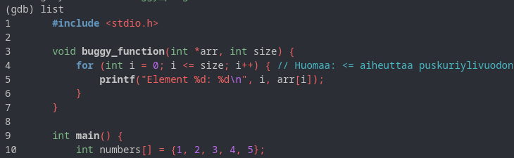

Tulosteessa näkee että koodiin on suoraan merkitty missä bugi sijaitsee ja mitä se tekee, tässä tapauksessa silmukka toistuu liian monesti.

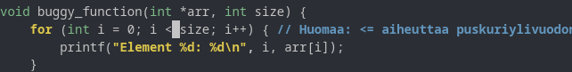

Muutetaan silmukan ehtoa siten, että '<=' vaihtuu '<' merkkiin jolloin silmukka pysähtyy ajoissa.

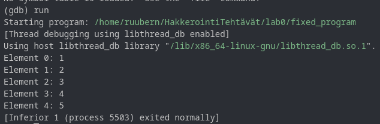

Tehtävä suoritettu hekä hieman väärässä järjestyksessä, mutta seuraavaksi tarkastellaan bugia gdb avulla.

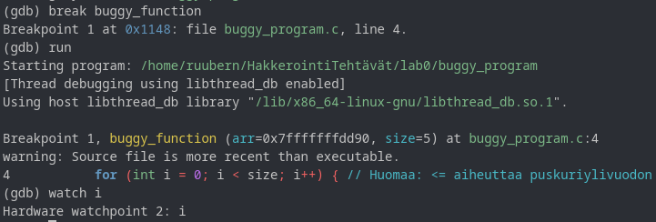

Asetin breakpointin buggy_functioniin ja ajoin ohjelman, jonka jälkeen lisäsin watchpoint i, jonka avulla pitäisi pystyä tarkastelemaan i:n arvoja.

Etenin silmukassa "continue" -komennolla.

Tässä näkyy se kohta silmukassa, missä i = 5 ja ylivuoto tapahtuu.

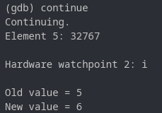

## lab1

Lähdin tutkimaan lab1 avaamalla gdb ja ajamalla ohjelman.

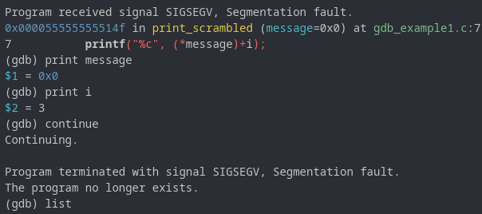

Ohjelma kaatuu ja antaa signaalin SIGSEGV. Tässä kohta myös tulostin muuttujat message ja i, jotta sain tietää niiden arvot.

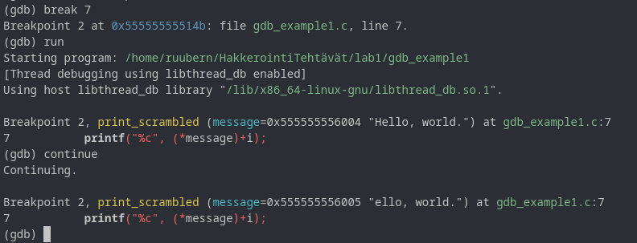

Asetin breakpointin riville 7 (rivi jolla debunker ilmoitti ongelmasta), ajoin ohjelman uudelleen ja etenin continuella. Näyttää sille että ohjelma iteroi jokaisen merkin messagesta ja siirtää niitä 3 merkkiä eteenpäin ASCII merkistössä. (Tätä käytiin aikaisemmin kurssilla läpi Caesar cipher) ja lopuksi tulostaa salatun viestin.

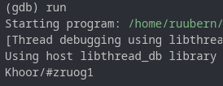

Käytin "list" komentoa tarkastelemaan lähdekoodia.

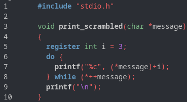

Tässä näkyy print_scrambled() funktio joka tekee salauksen.

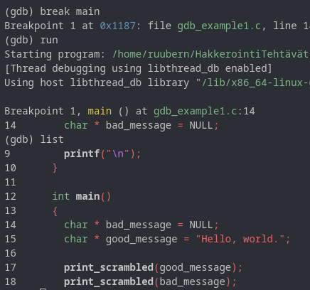

Asetin breakpointin main funktioon ja ajoin ohjelman. Sitten listasin main funktion sisällön. Kuvasta näkee että siellä kutsutaan print_scrambled functiota kahdesti ja sille annetaan eri parametri (message) kummallakin kerralla. Ensimmäisessä kutsussa parametri on "Hello, world." ja toisella NULL. Luulen että kun kutsuttu funktio yrittää tulostaa nimenomaan merkkiä niin NULL parametri johtaa ohjelman kaatumiseen. Tämä voidaan estää joko vaihtamalla parametri NULL tai muuttamalla print_scrambled funktiota.

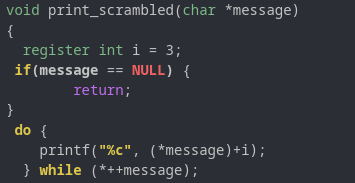

Lisäsin koodiin if lauseen joka palauttaa funktion ennen kuin silmukka alkaa jos message on NULL. Sitten vielä testasin että se toimii.

## lab2

Toinen tiedosto lab2 oli aikaisempi harjoitus jonka olin jo suorittanut joten jätin sen tekemättä ja siirryin pastr2o tehtävään.

Tämä oli haastava tehtävä. Ilman apua pääsin niinkin pitkälle kuin käyttämään komennon disassemble main.

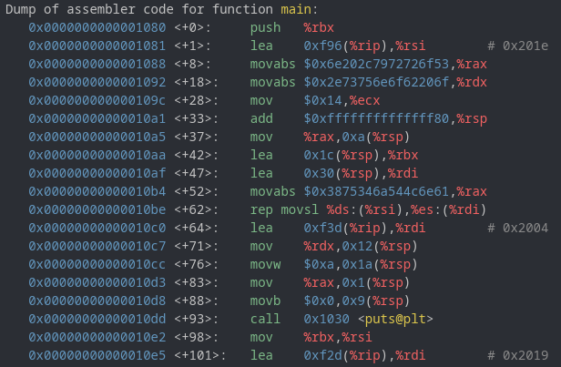

Tässä on main funktion assembly koodi jota en osaa oikeastaan lukea. Löysin lopulta netistä payatu.com blogin jossa käydään läpi vastaavaa tehtävää, merkittävänä erona siinä on se että siinä käytettävässä assemly koodissa on strcmp kutsu näkyvissä, joten siitä on helppo paikantaa tietoja joita halutaan etsiä. Opin kuitenkin että tieto on tallennettuna rekisteriin jota merkitään assemblyssa rdi lyhenteellä. Tutkailin tehtävän koodia ja keksin asettaa breakpointin jokaiseen kutsuun (CALL) jotta voin tarkistaa x/s rdi komennolla mitä rdi:stä löytyy sillä hetkellä. Rajasin kutsuja kuitenkin siten, että asetin breakpoint kutsut vain scan kutsun jälkeen.

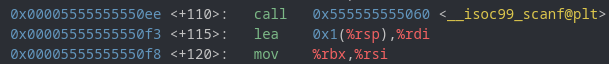

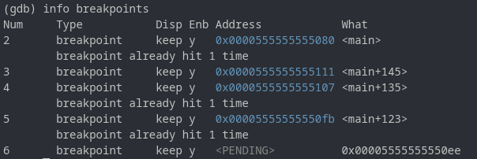

Breakpoint 5 kohdalla rdi löytyi merkkijono.

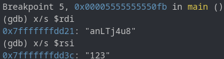

Testasin tuota merkkijonoa, mutta se ei ollut ratkaisu. Luulen että tämä on salattu versio salasanasta. Tätä pidemmälle en tehtävässä päässyt.

## lab3

Valitsin tehtäväksi crackme01.

Katsotaan assembly koodia "disassemble main" komennolla gdb:ssä.

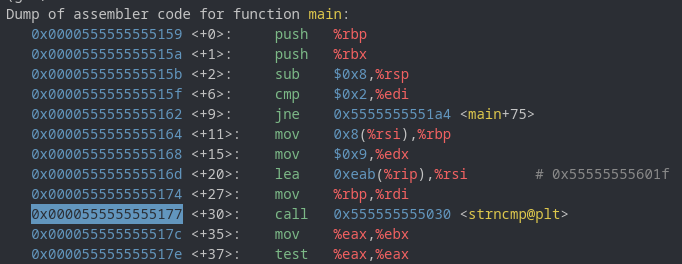

Kiinnitin huomiota tuohon "<<strncmp@plt>>" kutsuun ja laitoin siihen breakpointin. Jos koodissa verrataan salasanaa ja syötettä käyttämällä strncmp, niin sieltä voi löytyä tehtävän vastaus.

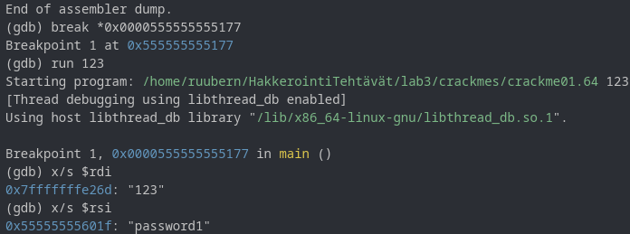

Asetin breakpointin kohtaan ja ajoin sovelluksen. Kun pääsin breakpointtiin tarkastelin mitä muistista löytyy ja siellä on "password1".

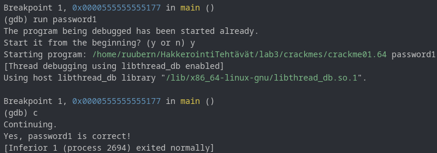

Ajoin ohjelman uudelleen syötteellä "password1" ja se toimi.

## Lähteet

- payatu, *learning to reverse engineer with gdb* — https://payatu.com/blog/learning-to-reverse-engineer-with-gdb/