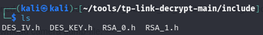
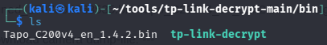
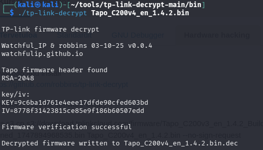
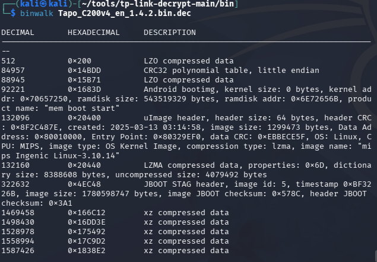
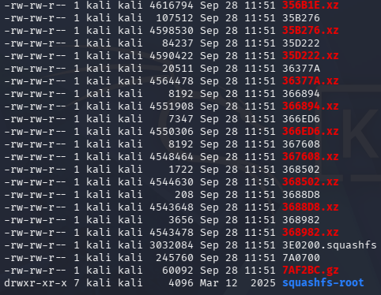
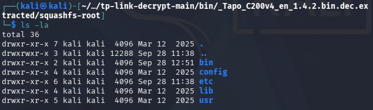
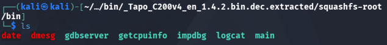
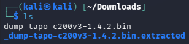
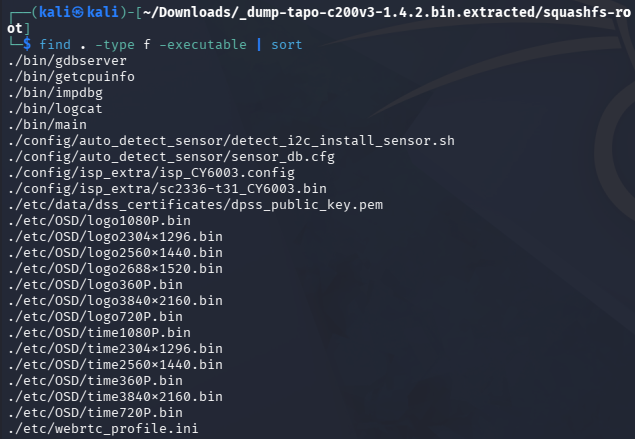
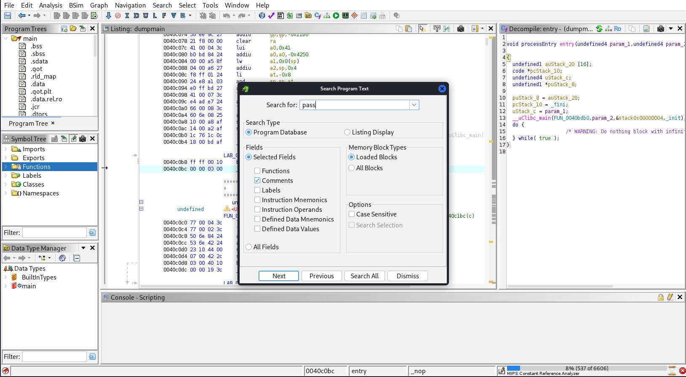

# h6

## Valmistelut
Tätä tehtävää varten loin uuden Kali pohjaisen virtuaali koneen.
Latasin tp-link-decrypt ohjelman githubista zip tiedostona ja purin sen tools hakemistoon.
Asensin AWSCLI, jotta sain TapoV3 firmware binaryn ladattua komennolla "aws s3 cp s3://download.tplinkcloud.com/firmware/Tapo_C200v3_en_1.4.2_Build_250313_Rel.40499n_up_boot-signed_1747894968535.bin Tapo_C200v4_en_1.4.2.bin --no-sign-request"
Latasin myös moodlesta camera tapo V200 v3 dump filen.

## 1 Decrypting firmware image
Aloitin tehtävän avaamalla tp-link-decrypt hakemiston ja ajamalla 'preinstall.sh', jonka jälkeen ajoin extractkeys.sh
  
Tässä näkyy avaimet, jotka ohjelma loi include hakemistoon. Tämän jälkeen ajoin 'make' komennon, joka loi bin tiedoston, joka sisälsi tp-link-decryptin. Siirsin myös Tapo_C200v4_en_1.4.2.bin tiedoston kyseiseen hakemistoon.
  
Ja sitten decryptasin tiedoston
  

## 2 Analyze the imagefile
Lähdin tutkimaan tiedostoa binwalk komennolla. 
  
Ja tiedostot näyttävät olevan pakattu. 

## 4 Extract root from image file
Tässä kohtaa kysyin Claude Sonnet 5 (medium) apua.

Suoritin binwalk -e Tapo_C200v4_en_1.4.2.bin.dec loi extract tiedoston, joka näytti tältä.
  
Ja tämän hakemiston sisältä löytyi squashfs-root hakemisto.
  
root hakemistoa tutkiessani löysin main tiedoston.
  

## 3 Extract root from the dump file
 
Suoritin binwalk -e komennon myös dump filelle jonka latasin moodlesta. Myöst täältä löytyy squashfs-root.

## 5 search available applications
Listasin kaikki tiedostot joihin löytyy suoritus oikeus.
  
Suoritettavat ohjelmat jota komento löysi sijaitsevat bin tiedostossa.
Niitä ovat:
* main          (pääohjelma)
* gdbserver     (debug palvelin)
* impdbg        (debug työkalu)
* logcat        (lokitustyökalu)
* getcpuinfo    (laitteistotieto apuohjelma)

## 6 analyzing and opening the password
Latasin dump filen main tiedoston ghidraan ja aloitin sen tutkimisen, pyrin etsimään go to ominaisuudella passwordiin liittyviä asioita.
  